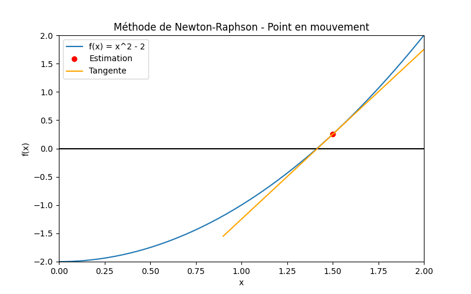

# Newton---Raphoson---Animation
#Visualisatoon- animée-methode-Newton-Raphson en Python
# Newton-Raphson Animation – Visualisation et Machine Learning



## Description

Ce projet illustre la **méthode de Newton-Raphson** pour résoudre l'équation :

\[
f(x) = x^2 - 2
\]

- La **courbe bleue** représente la fonction \(f(x)\).  
- La **tangente orange** à chaque étape montre la direction de correction.  
- Le **point rouge** représente l’estimation actuelle \(x_n\) qui **se déplace vers la racine** à chaque itération.  

Le projet montre également l’analogie avec le **Machine Learning** :  
- Chaque point = paramètre actuel du modèle  
- Tangente = gradient / correction  
- Déplacement vers la racine = convergence vers les paramètres optimaux  

💡 Concept clé : **estimation initiale + corrections successives = convergence rapide vers la solution**.

---

## Fonction principale

La fonction utilisée dans ce projet est :

```python
def f(x):
    return x**2 - 2

def df(x):
    return 2*x
